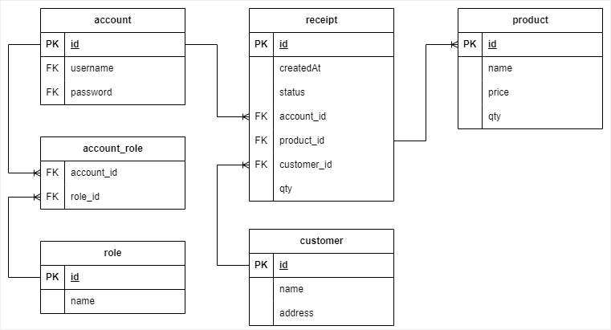

# PPN-Project

A Spring Boot application demonstrating secure authentication and authorization using JWT (JSON Web Tokens) with role-based access control for managing receipts, products, and customers.

## Project Overview

PPN-Project is a RESTful API application built with Spring Boot that implements secure authentication and authorization mechanisms. 
It uses JWT for stateless authentication and provides role-based access control to protect resources. 
The application allows for management of receipts, products, and customers with different access levels based on user roles.

## Features

- User registration and authentication
- JWT-based authentication
- Token invalidation (logout)
- Role-based access control (RBAC)
- Token introspection
- Secure password handling with BCrypt
- CRUD operations for receipts, products, and customers
- Exception handling with custom error codes
- Validation for request data

## Project Structure

```
src/main/java/com/utc/ppnproject/
├── configuration/           # Application and security configuration
├── constant/                # Constants used throughout the application
├── controller/              # REST controllers
├── dto/                     # Data Transfer Objects
│   ├── request/             # Request DTOs
│   └── response/            # Response DTOs
├── entity/                  # JPA entities
├── exception/               # Custom exceptions and error handling
├── repository/              # Data repositories
├── security/                # Security-related components
│   ├── jwt/                 # JWT utilities and configuration
│   └── service/             # Security services
└── service/                 # Business logic services
    ├── base/                # Base service interfaces and implementations
    └── impl/                # Service implementations
```

## Technologies Used

- Java 17
- Spring Boot
- Spring Security
- Spring Data JPA
- MySQL Database
- Gradle
- Lombok for reducing boilerplate code
- BCrypt for password hashing
- JWT (JSON Web Tokens)

## Setup and Installation

### Prerequisites

- JDK 17 or higher
- MySQL 8.0 or higher
- Gradle 7.0 or higher

### Configuration

1. Clone the repository
   ```bash
   git clone https://github.com/yourusername/PPN-Project.git
   cd PPN-Project
   ```

2. Configure the database connection in `src/main/resources/application.properties`:
   ```properties
   spring.datasource.url=jdbc:mysql://localhost:3306/PPNProjectDB?createDatabaseIfNotExist=true
   spring.datasource.username=your_username
   spring.datasource.password=your_password
   ```

3. Configure JWT settings in `application.properties`:
   ```properties
   jwt.signerKey=your_secret_key
   jwt.valid-duration=7200
   jwt.refreshable-duration=72000
   ```

### Building and Running

```bash
# Using Gradle
./gradlew build
./gradlew bootRun
```

The application will start on port 8080 by default.

## API Endpoints

### Authentication

- **POST /auth/login** - Login, authenticate a user and get a JWT token
  ```json
  {
    "username": "user",
    "password": "password"
  }
  ```

- **POST /auth/logout** - Invalidate a JWT token
  ```json
  {
    "token": "your_jwt_token"
  }
  ```

- **POST /accounts/register** - Register a new user
  ```json
  {
    "username": "newuser",
    "password": "password",
    "confirmPassword": "confirmPassword"
  }
  ```

### Receipts

- **POST /receipts/** - Create a new receipt
  ```json
  {
    "productId": "product-id",
    "qty": 1,
    "customerId": "customer-id"
  }
  ```
  
- **GET /receipts/** - List all receipts
- **GET /receipts/s?id={id}** - Find receipt by ID
- **PUT /receipts/** - Update a receipt
  ```json
  {
    "id": "receipt-id",
    "status": "Paid"
  }
  ```

- **POST /receipts/cancel?id={id}** - Cancel/delete a receipt

### Products

- **POST /products/** - Create a new product
  ```json
  {
    "name": "product's name",
    "price": 123,
    "qty": 123
  }
  ```

- **GET /products/** - List all products
- **GET /products/s?id={id}** - Find product by ID
- **PUT /products/** - Update a product
  ```json
  {
    "id": "product-id",
    "name": "product's name",
    "price": 123,
    "qty": 123
  }
  ```

- **DELETE /products/?id={id}** - Delete a product

### Customers

- **POST /customers/** - Create a new customer
  ```json
  {
    "name": "customer's name"
  }
  ```

### Role-Based Endpoints

- **GET /role-based/admin** - Endpoint accessible only to users with ADMIN role
- **GET /role-based/user** - Endpoint accessible only to users with USER role

## Security Implementation

- **Authentication**: JWT-based authentication with token expiration
- **Authorization**: Role-based access control using Spring Security
- **Password Security**: BCrypt password hashing
- **Token Invalidation**: Blacklisting of invalidated tokens for logout functionality

## Database Schema

The application uses the following main entities:
- Account - User accounts with roles
- Customer - Customer information
- Product - Product details including price and quantity
- Receipt - Transactions linking accounts, products, and customers

